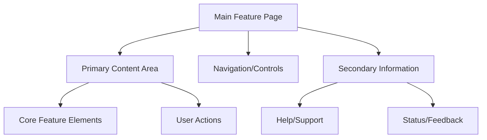
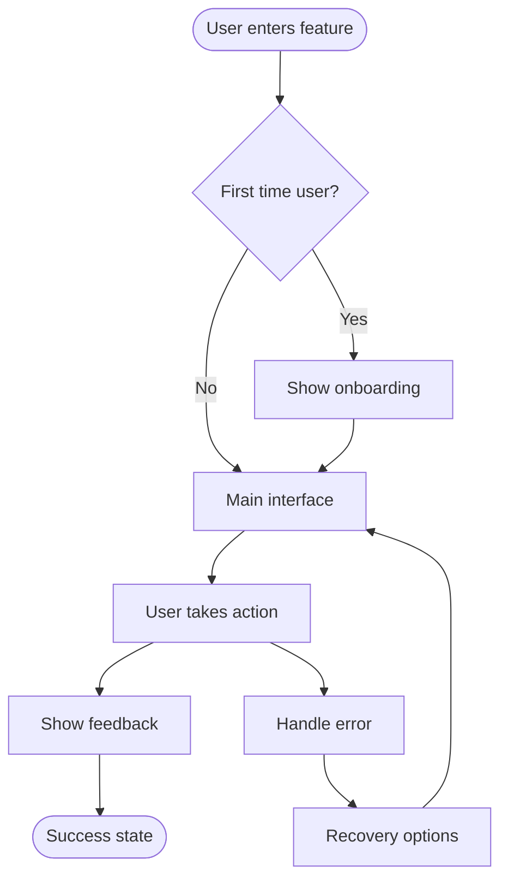
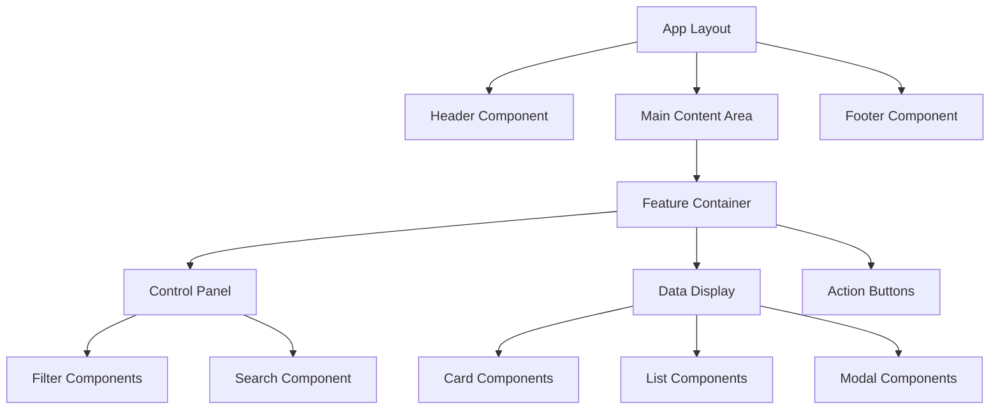
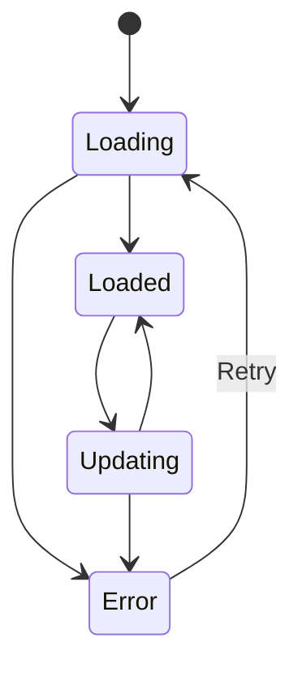

version: "1.0.0"
re4c_version: "1.0.0"
category: "core"
last_updated: "2025-09-08"

# /create-drd - Design Requirements Document Creation

**Purpose**: Transform PRD into concrete design specifications with information architecture, visual design, and user experience patterns  
**Philosophy**: Bounded by PRD constraints, avoid one-way doors, enable future requirements  
**Previous Step**: Complete `/create-prd` first  
**Next Step**: Use `/create-trd` for technical specifications

Create a comprehensive Design Requirements Document that defines the user experience, information architecture, and visual design patterns.

## Process Overview

If not explicitly told which PRD to use:
- List available PRDs from `/tasks` directory (files starting with `prd-`)  
- Exclude any that already have corresponding DRDs (`drd-*.md`)
- **Always** ask user to confirm PRD selection before proceeding
- Provide numbered options for easy selection

## Detailed Process (Two-Phase Workflow)

### Phase 1: Design Analysis and Clarification

1. **Receive PRD Reference:** User specifies PRD file to base design on
2. **Analyze PRD for Design Implications:**
   - Identify all user interactions and touchpoints
   - Note any future requirements (mobile, accessibility, internationalization, etc.)
   - List mentioned user types and their different needs
   - Identify potential one-way door design decisions
   - Extract any existing design constraints or brand requirements

3. **Assess Current Design State:** Review existing codebase (when available)
   - Identify existing component libraries (shadcn/ui, Tailwind, custom components)
   - Document current design patterns and conventions
   - Note existing color schemes, typography, spacing systems
   - List reusable UI patterns (forms, navigation, data display)
   - Identify any accessibility implementations
   - Document responsive design approaches

4. **Ask Design Clarification Questions:** Must ask clarifying questions to gather design requirements
   
   **Information Architecture Questions:**
   - "How should users navigate between different sections of the feature?"
   - "What information needs to be visible at a glance vs. on-demand?"
   - "How should related information be grouped and presented?"

   **User Experience Questions:**
   - "What are the primary user flows for this feature? Can you describe the happy path?"
   - "What should happen when users make mistakes or encounter errors?"
   - "Are there different experience levels of users we need to accommodate?"
   - "What actions should be most prominent vs. secondary?"

   **Visual Design Questions:**
   - "Should this feature feel integrated with existing design or stand out as distinct?"
   - "Are there any brand guidelines, color schemes, or visual styles to follow?"
   - "What level of visual complexity is appropriate for your users?"

   **Future-Proofing Questions:**
   - "Based on your PRD, I see mention of [future requirement]. How should the design accommodate this?"
   - "Are there any design decisions that could limit future expansion mentioned in the PRD?"
   - "Should the design consider mobile/tablet experiences even if not in current scope?"

   **Technical Constraints:**
   - "Are there any performance constraints that should influence the design (loading times, data usage)?"
   - "Do you have accessibility requirements (WCAG compliance, screen reader support)?"

   Always provide options in letter/number lists for easy selection.

5. **Generate DRD Structure:** Present the planned design approach and wait for confirmation:
   ```
   "I've analyzed your PRD and current codebase. Based on your answers, I'm planning to create a DRD with:
   - [X] sections covering information architecture, user flows, and component design
   - Mermaid diagrams for user flows and component relationships
   - [X] complexity levels with fallback options
   - Future-proofing for [specific PRD requirements]
   
   Ready to generate the full DRD? Respond with 'Go' to proceed."
   ```

### Phase 2: DRD Generation

6. **Wait for Confirmation:** Pause for user "Go" response

7. **Generate Complete DRD:** Create comprehensive design specification using the structure below

8. **Save DRD:** Save as `drd-[feature-name].md` in `/tasks/` directory

## DRD Structure (Required Format)

```markdown
# Design Requirements Document: [Feature Name]

**Generated from:** `[prd-filename]`  
**Date:** [timestamp]  
**Design Complexity:** [Simple|Moderate|Complex]  
**Future Requirements Considered:** [list from PRD]

## Executive Summary

### Design Goals
- [Primary design objective from PRD]
- [Secondary design objectives]
- [User experience principles to follow]

### Future-Proofing Considerations
- [Mobile/responsive requirements from PRD]
- [Accessibility requirements]
- [Scalability considerations]
- [Integration requirements]

### One-Way Door Decisions to Avoid
- [Design choices that could limit PRD-mentioned future features]
- [Architectural decisions that affect design flexibility]

## Information Architecture

### Content Hierarchy


### Navigation Patterns
- **Primary Navigation:** [How users move between major sections]
- **Secondary Navigation:** [How users access sub-features]
- **Breadcrumbs:** [When and how to show user location]
- **Back/Cancel Patterns:** [How users exit or undo actions]

### Content Organization
- **Above the fold:** [Most critical information/actions]
- **Progressive disclosure:** [How complex information is revealed]
- **Grouping strategy:** [How related items are clustered]
- **Prioritization:** [Visual hierarchy for different content types]

## User Experience Design

### User Flows

#### Primary Flow: [Main user journey]


#### Secondary Flows
- **Error Recovery:** [How users recover from mistakes]
- **First-Time User:** [Onboarding and guidance patterns]
- **Power User:** [Advanced features and shortcuts]
- **Mobile User:** [Touch-optimized interactions]

### Interaction Patterns

#### Form Interactions
- **Input validation:** [Real-time vs. on-submit feedback]
- **Error states:** [How errors are displayed and resolved]
- **Success states:** [Confirmation and next steps]
- **Loading states:** [Progress indication during processing]

#### Data Display
- **Empty states:** [What users see when no data exists]
- **Loading states:** [Skeleton screens vs. spinners]
- **Error states:** [Network failures, permission issues]
- **Success states:** [Data presentation patterns]

#### Micro-interactions
- **Hover effects:** [Button and link feedback]
- **Click feedback:** [Immediate response to user actions]
- **Transitions:** [Page and component state changes]
- **Animations:** [Loading, success, error animations]

## Visual Design System

### Design Principles
- **Consistency:** [How this feature aligns with existing design]
- **Clarity:** [Information hierarchy and readability]
- **Efficiency:** [Reducing cognitive load and steps]
- **Accessibility:** [Color contrast, screen reader support]

### Color Palette
```
Primary Colors:
- [Color name]: [Hex code] - [Usage description]
- [Color name]: [Hex code] - [Usage description]

Secondary Colors:
- [Color name]: [Hex code] - [Usage description]

System Colors:
- Success: [Hex code]
- Warning: [Hex code]  
- Error: [Hex code]
- Info: [Hex code]
```

### Typography Scale
- **Display:** [Font, size, weight] - [Usage: headers, titles]
- **Heading:** [Font, size, weight] - [Usage: section headers]
- **Body:** [Font, size, weight] - [Usage: main content]
- **Caption:** [Font, size, weight] - [Usage: metadata, hints]
- **Code:** [Font, size, weight] - [Usage: technical content]

### Spacing System
- **XS:** [4px] - [Usage: tight spacing]
- **SM:** [8px] - [Usage: component padding]
- **MD:** [16px] - [Usage: standard spacing]
- **LG:** [24px] - [Usage: section spacing]
- **XL:** [32px] - [Usage: major sections]

### Component Specifications

#### Buttons
```
Primary Button:
- Background: [Color]
- Text: [Color] 
- Border: [Specification]
- Padding: [Spacing]
- Border radius: [Value]
- Hover state: [Changes]
- Focus state: [Changes]
- Disabled state: [Changes]

Secondary Button:
[Similar specifications]

Tertiary/Text Button:
[Similar specifications]
```

#### Form Elements
```
Input Fields:
- Background: [Color]
- Border: [Color, width]
- Padding: [Spacing]
- Focus state: [Border color, shadow]
- Error state: [Border color, background]
- Success state: [Border color, icon]

Labels:
- Typography: [Font, size, weight]
- Color: [Color]
- Spacing: [Distance from input]

Help Text:
- Typography: [Font, size, weight] 
- Color: [Color]
- Spacing: [Position relative to input]
```

#### Data Display
```
Cards:
- Background: [Color]
- Border: [Color, width, radius]
- Shadow: [Specification]
- Padding: [Internal spacing]
- Margin: [External spacing]

Tables:
- Header styling: [Background, typography, borders]
- Row styling: [Alternating colors, hover states]
- Cell padding: [Spacing]
- Responsive behavior: [Mobile adaptation]

Lists:
- Item spacing: [Vertical rhythm]
- Separators: [Style, color]
- Interactive states: [Hover, selected]
```

## Component Architecture

### Component Hierarchy


### Reusable Components

#### Layout Components
- **Container:** [Max width, padding, responsive behavior]
- **Grid System:** [Columns, gutters, breakpoints]
- **Flexbox Utilities:** [Direction, alignment, spacing]

#### UI Components  
- **Button:** [Variants, sizes, states]
- **Input:** [Types, validation, states]
- **Card:** [Content layouts, actions, metadata]
- **Modal:** [Sizes, animation, backdrop behavior]
- **Dropdown:** [Trigger styles, menu layout, selection]

#### Feature-Specific Components
- **[Component Name]:** [Purpose, props, behavior]
- **[Component Name]:** [Purpose, props, behavior]

### State Management Patterns

#### Component State


#### Form State Management
- **Initial:** [Default values, validation rules]
- **Editing:** [Dirty state tracking, real-time validation]
- **Submitting:** [Loading indicators, disabled states]
- **Success:** [Confirmation, next steps]
- **Error:** [Error display, recovery options]

## Responsive Design Strategy

### Breakpoint Strategy
```
Mobile: 0-767px
- [Layout adaptations]
- [Navigation changes]
- [Content prioritization]

Tablet: 768-1023px  
- [Layout adaptations]
- [Touch optimization]
- [Content reorganization]

Desktop: 1024px+
- [Full feature access]
- [Hover interactions]
- [Optimal information density]
```

### Mobile-First Considerations
- **Touch targets:** [Minimum sizes, spacing]
- **Gesture support:** [Swipe, pinch, long press]
- **Performance:** [Image optimization, lazy loading]
- **Offline:** [Cached content, sync indicators]

## Accessibility Requirements

### WCAG 2.1 AA Compliance
- **Color contrast:** [Ratios for all text and interactive elements]
- **Keyboard navigation:** [Tab order, focus indicators]  
- **Screen readers:** [ARIA labels, semantic HTML]
- **Motion:** [Respect prefers-reduced-motion]

### Inclusive Design Patterns
- **Error prevention:** [Clear labels, validation, confirmation]
- **Error recovery:** [Clear messaging, multiple pathways]
- **Cognitive load:** [Progressive disclosure, clear hierarchy]
- **Motor accessibility:** [Large targets, drag alternatives]

## Complexity Management

### Design Complexity Levels

#### Level 1: Minimal Viable Design (Fallback)
**Scope:** [Reduced feature set that still meets core PRD requirements]
- **Components:** [Essential components only]
- **Interactions:** [Basic form submission, simple feedback]
- **Visual design:** [System defaults, minimal customization]
- **Responsive:** [Single column layout, basic mobile adaptation]

#### Level 2: Standard Implementation (Target)
**Scope:** [Full PRD requirements with good UX]
- **Components:** [Custom components, consistent design system]
- **Interactions:** [Smooth transitions, helpful micro-interactions]  
- **Visual design:** [Custom styling, brand consistency]
- **Responsive:** [Optimized for all screen sizes]

#### Level 3: Enhanced Experience (Stretch)
**Scope:** [Exceeds PRD with delightful experiences]
- **Components:** [Advanced interactions, animation system]
- **Interactions:** [Sophisticated state management, predictive UX]
- **Visual design:** [Custom illustrations, advanced theming]
- **Responsive:** [Device-specific optimizations]

### Circuit Breakers

#### Visual Design Circuit Breakers
- **Custom design → System defaults:** [Use existing component library]
- **Complex animations → Simple transitions:** [CSS transitions over JS animations]
- **Custom layouts → Standard patterns:** [Use proven layout patterns]

#### Interaction Circuit Breakers  
- **Rich interactions → Basic forms:** [Standard form submission over AJAX]
- **Real-time updates → Page refresh:** [Traditional page loads over WebSocket]
- **Advanced validation → Basic validation:** [Simple required field checking]

#### Content Circuit Breakers
- **Dynamic content → Static content:** [Hardcoded options over API calls]
- **Personalization → Generic experience:** [Same experience for all users]
- **Rich media → Text content:** [Text descriptions over images/video]

## Implementation Notes

### Design System Integration
- **Existing components to leverage:** [List from codebase analysis]
- **New components needed:** [Components not found in current system]
- **Customization approach:** [How to extend existing components]

### Performance Considerations  
- **Image optimization:** [Sizes, formats, loading strategy]
- **Font loading:** [Subsetting, fallbacks, display swap]
- **CSS organization:** [Critical CSS, code splitting]
- **JavaScript bundles:** [Component lazy loading]

### Browser Support
- **Target browsers:** [Based on user analytics or requirements]
- **Progressive enhancement:** [Fallbacks for advanced features]
- **Polyfills needed:** [For older browser support]

## Testing Strategy

### Visual Testing
- **Component testing:** [Storybook, visual regression]
- **Cross-browser testing:** [Key browsers and versions]
- **Device testing:** [Physical device testing plan]

### Usability Testing  
- **User testing scenarios:** [Key flows to validate with users]
- **Accessibility testing:** [Screen reader, keyboard navigation]
- **Performance testing:** [Core Web Vitals, perceived performance]

### A/B Testing Opportunities
- **Design variations:** [Elements that could benefit from testing]
- **Success metrics:** [How to measure design effectiveness]

## Success Metrics

### User Experience Metrics
- **Task completion rate:** [Percentage of successful user journeys]
- **Time to completion:** [Speed of primary user flows]
- **Error recovery rate:** [How well users recover from mistakes]
- **User satisfaction:** [Qualitative feedback, NPS scores]

### Technical Performance Metrics
- **Page load time:** [Target loading speeds]
- **Core Web Vitals:** [LCP, FID, CLS targets]
- **Accessibility score:** [Lighthouse accessibility rating]

## Open Questions

### Design Decisions Requiring Input
- [Questions about design choices that affect implementation]
- [Areas where multiple valid approaches exist]
- [Trade-offs between user experience and technical complexity]

### Future Considerations  
- [How this design could evolve with PRD-mentioned future features]
- [Potential integration points with other features]
- [Long-term maintenance and scalability concerns]
```

## Final Instructions

1. **Do NOT start implementing the design**
2. **Ask all clarifying questions** before generating the DRD
3. **Consider future PRD requirements** to avoid one-way doors
4. **Use mermaid diagrams** for flows and architecture
5. **Be concrete and specific** with measurements and specifications
6. **Include complexity fallbacks** for implementation flexibility
7. **Reference existing codebase patterns** when available

