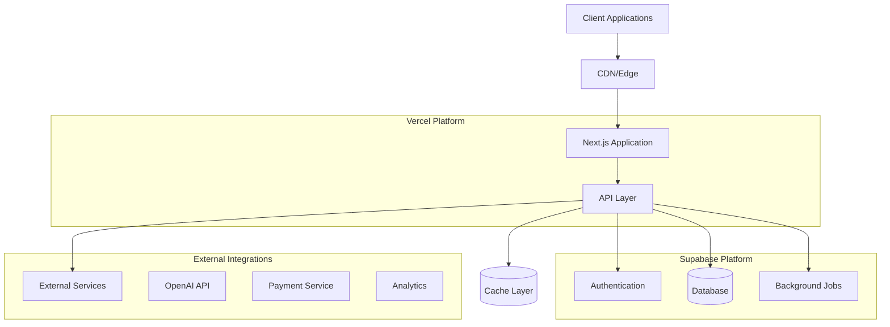
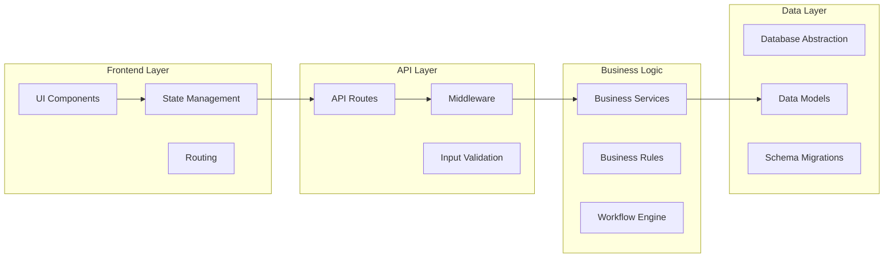
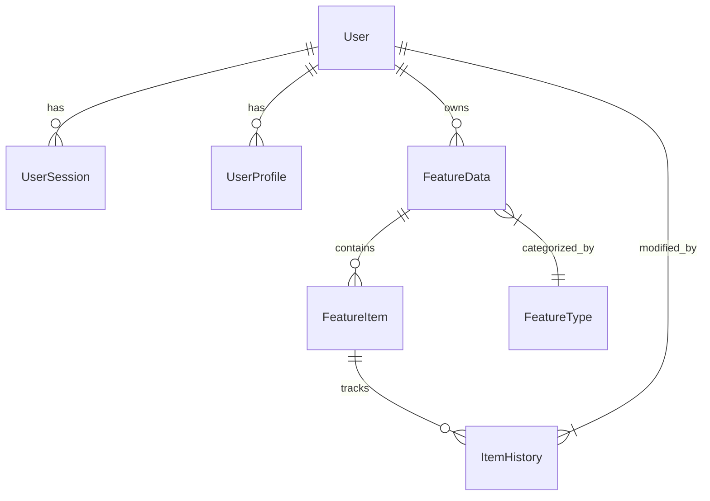
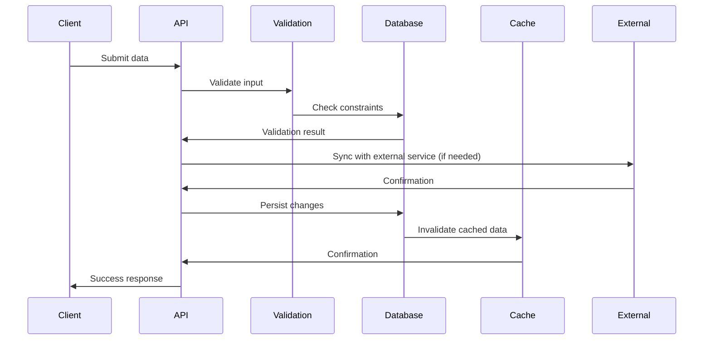
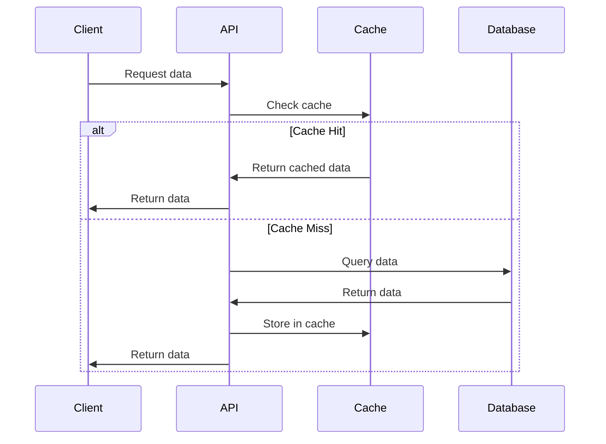
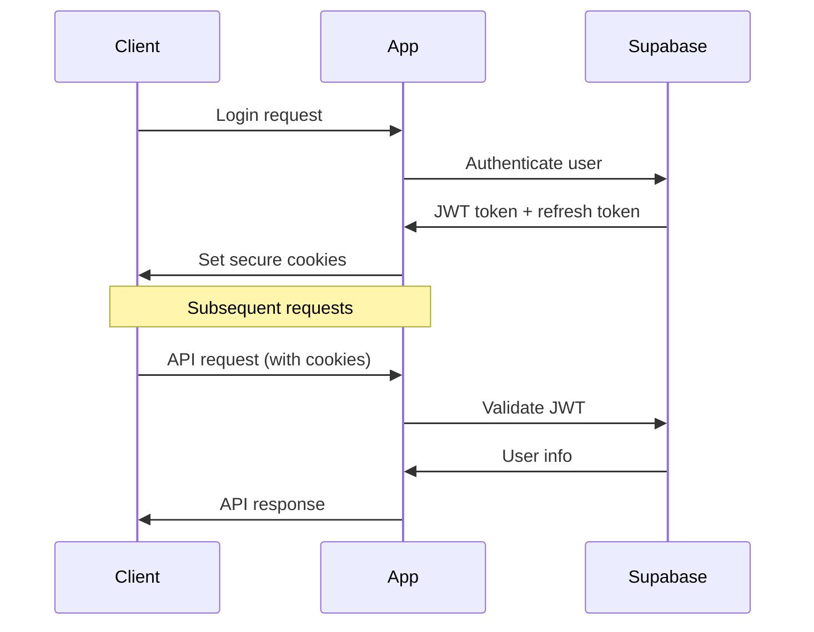

version: "1.0.0"
re4c_version: "1.0.0"
category: "core"
last_updated: "2025-09-08"

# /create-trd - Technical Requirements Document Creation

**Purpose**: Transform PRD and DRD into concrete technical specifications with system architecture, data models, and implementation patterns  
**Philosophy**: Bounded by PRD constraints, informed by DRD, avoid one-way doors, enable future requirements  
**Previous Step**: Complete `/create-prd` and optionally `/create-drd` first  
**Next Step**: Use `/generate-slices` or `/generate-tasks` for implementation planning

Create a comprehensive Technical Requirements Document that defines the system architecture, data models, API design, and integration patterns.

## Process Overview

If not explicitly told which PRD to use:
- List available PRDs from `/tasks` directory (files starting with `prd-`)
- Check for existing DRDs (`drd-*.md`) and include in analysis
- Exclude PRDs that already have corresponding TRDs (`trd-*.md`)
- **Always** ask user to confirm PRD/DRD selection before proceeding
- Provide numbered options for easy selection

## Detailed Process (Two-Phase Workflow)

### Phase 1: Technical Analysis and Clarification

1. **Receive PRD/DRD References:** User specifies PRD file and any existing DRD
2. **Analyze PRD for Technical Implications:**
   - Identify all data storage and processing requirements
   - Note any future technical requirements (mobile APIs, integrations, scale)
   - List mentioned performance, security, or compliance requirements
   - Identify potential one-way door technical decisions
   - Extract any existing technology constraints or preferences

3. **Analyze DRD Integration (when available):**
   - Review component architecture from DRD
   - Identify data flow requirements from user flows
   - Note any technical constraints implied by design decisions
   - Ensure backend architecture supports planned UI patterns

4. **Assess Current Technical State:** Review existing codebase
   - Identify current technology stack (Next.js, Supabase, etc.)
   - Document existing database schema and models
   - Note current API patterns and authentication
   - List existing integrations and external services
   - Document current deployment and infrastructure setup
   - Identify existing testing and CI/CD patterns

5. **Ask Technical Clarification Questions:** Must ask clarifying questions to gather technical requirements

   **Architecture Questions:**
   - "What are your expected user volumes and growth trajectory?"
   - "Do you have preferences between server-side and client-side rendering for this feature?"
   - "Are there any compliance requirements (GDPR, HIPAA, SOX) that affect technical decisions?"

   **Data Management Questions:**
   - "What data needs to be stored, and how long should it be retained?"
   - "Do you need real-time updates, or is eventual consistency acceptable?"
   - "Are there any data integration requirements with existing systems?"
   - "What level of data consistency is required (strong vs. eventual)?"

   **Performance & Scale Questions:**
   - "What are your performance expectations for this feature (response times, throughput)?"
   - "Do you anticipate high traffic spikes or steady usage patterns?"
   - "Are there any geographic distribution requirements for users?"

   **Integration Questions:**
   - "What external services need to be integrated (payment, auth, analytics, etc.)?"
   - "Are there any existing APIs or databases this feature must work with?"
   - "Do you have preferences for third-party service providers?"

   **Security Questions:**
   - "What level of access control is needed (public, authenticated, role-based)?"
   - "Are there any sensitive data handling requirements?"
   - "Do you need audit logging or user activity tracking?"

   **Future-Proofing Questions:**
   - "Based on your PRD, I see mention of [future requirement]. How should the technical architecture accommodate this?"
   - "Are there any technical decisions that could limit future expansion mentioned in the PRD?"
   - "Should the architecture consider mobile apps, third-party integrations, or API access even if not in current scope?"

   Always provide options in letter/number lists for easy selection.

6. **Technology Stack Assessment:** Present recommended stack and wait for confirmation:
   ```
   "Based on your PRD analysis and current codebase, I recommend:
   
   Core Stack:
   - Frontend: [Next.js/React/etc.]
   - Backend: [Supabase/custom API/etc.]
   - Database: [PostgreSQL/etc.]
   - Authentication: [Supabase Auth/etc.]
   - Deployment: [Vercel/etc.]
   
   Additional Services:
   - [External integrations needed]
   
   Alternative options for [specific requirements]:
   - Option A: [Description, pros/cons]
   - Option B: [Description, pros/cons]
   
   Ready to generate the full TRD? Respond with 'Go' to proceed."
   ```

### Phase 2: TRD Generation

7. **Wait for Confirmation:** Pause for user "Go" response

8. **Generate Complete TRD:** Create comprehensive technical specification using the structure below

9. **Save TRD:** Save as `trd-[feature-name].md` in `/tasks/` directory

## TRD Structure (Required Format)

```markdown
# Technical Requirements Document: [Feature Name]

**Generated from:** `[prd-filename]` + `[drd-filename]` (if available)  
**Date:** [timestamp]  
**Technical Complexity:** [Simple|Moderate|Complex|Enterprise]  
**Target Stack:** [Primary technology decisions]  
**Future Requirements Considered:** [list from PRD]

## Executive Summary

### Technical Goals
- [Primary technical objectives from PRD]
- [Performance and scalability targets]
- [Integration and compatibility requirements]

### Architecture Principles
- [Scalability approach (vertical vs. horizontal)]
- [Data consistency requirements]
- [Security and compliance standards]
- [Maintainability and extensibility goals]

### Future-Proofing Considerations
- [Mobile API requirements from PRD]
- [Third-party integration capabilities]
- [Scaling and performance considerations]
- [Data migration and versioning strategies]

### One-Way Door Decisions to Avoid
- [Technical choices that could limit PRD-mentioned future features]
- [Architecture decisions that affect integration flexibility]
- [Database design choices that limit future query patterns]

## System Architecture

### High-Level Architecture


### Component Architecture


### Technology Stack

#### Core Platform (Default: Vercel + Supabase + OpenAI)
```
Frontend Framework: Next.js 14 (App Router)
- Reasoning: [Why this choice fits PRD requirements]
- Alternatives considered: [Other options and why rejected]
- Future compatibility: [How this supports PRD future needs]

Backend Platform: Supabase
- Database: PostgreSQL with Row Level Security
- Authentication: Supabase Auth with [provider list]
- Real-time: Supabase Realtime (if needed)
- Storage: Supabase Storage (if file uploads needed)

Deployment Platform: Vercel
- Edge Functions: For [specific use cases]
- Edge Config: For [configuration management]
- Analytics: Built-in performance monitoring
```

#### Alternative Stack (For Complex Requirements)
```
Custom Backend: [When Supabase limitations are hit]
- Framework: [Node.js/Python/Go choice and reasoning]
- Database: [PostgreSQL/MongoDB choice and reasoning]  
- Authentication: [Auth0/Firebase Auth/custom]
- Deployment: [AWS/GCP/Azure choice and reasoning]

Justification: [Specific PRD requirements that necessitate custom backend]
```

### Scalability Strategy

#### Horizontal Scaling Plan
```
Current Capacity: [Expected initial load]
Growth Projections: [Based on PRD business goals]

Scaling Triggers:
- Database connections > 80% of pool
- API response time > [X]ms
- CPU utilization > 70%
- Memory usage > 80%

Scaling Actions:
- Database: [Read replicas, connection pooling, sharding strategy]
- API: [Serverless auto-scaling, container orchestration]
- Cache: [Redis scaling, CDN optimization]
```

#### Performance Targets
```
Page Load Time: [X] seconds (95th percentile)
API Response Time: [X] milliseconds (95th percentile)  
Database Query Time: [X] milliseconds (average)
Concurrent Users: [X] users supported
Throughput: [X] requests per second
```

## Data Architecture

### Database Design

#### Schema Overview


#### Core Tables
```sql
-- Users table (extends Supabase auth.users)
CREATE TABLE public.user_profiles (
  id UUID REFERENCES auth.users(id) PRIMARY KEY,
  display_name TEXT,
  avatar_url TEXT,
  preferences JSONB DEFAULT '{}',
  created_at TIMESTAMP WITH TIME ZONE DEFAULT NOW(),
  updated_at TIMESTAMP WITH TIME ZONE DEFAULT NOW()
);

-- Feature-specific tables
CREATE TABLE [feature_main_table] (
  id UUID DEFAULT gen_random_uuid() PRIMARY KEY,
  user_id UUID REFERENCES public.user_profiles(id) NOT NULL,
  [specific fields based on PRD requirements],
  metadata JSONB DEFAULT '{}',
  created_at TIMESTAMP WITH TIME ZONE DEFAULT NOW(),
  updated_at TIMESTAMP WITH TIME ZONE DEFAULT NOW()
);

-- Indexes for performance
CREATE INDEX idx_[table]_user_id ON [table](user_id);
CREATE INDEX idx_[table]_created_at ON [table](created_at);
```

#### Row Level Security (RLS) Policies
```sql
-- Users can only access their own data
CREATE POLICY "Users can view their own profiles"
  ON public.user_profiles FOR SELECT
  USING (auth.uid() = id);

CREATE POLICY "Users can update their own profiles"  
  ON public.user_profiles FOR UPDATE
  USING (auth.uid() = id);

-- Feature-specific RLS
CREATE POLICY "[Feature] users can manage their own data"
  ON public.[feature_table] FOR ALL
  USING (auth.uid() = user_id);
```

### Data Flow Architecture

#### Create/Update Flow


#### Query Flow


### Caching Strategy

#### Cache Layers
```
Browser Cache:
- Static assets: 1 year
- API responses: [X] minutes
- User preferences: 1 hour

CDN Cache (Vercel Edge):
- Static pages: Until deployment
- API responses: [X] minutes
- Images: 1 month

Application Cache (Redis/Memory):
- User sessions: [X] minutes
- Expensive queries: [X] minutes
- External API responses: [X] minutes
```

#### Cache Invalidation
```
Event-Driven Invalidation:
- User data changes → Invalidate user-specific cache
- Global data changes → Invalidate related global cache
- External API updates → Invalidate integration cache

Time-Based Invalidation:
- User preferences: 1 hour TTL
- Reference data: 24 hour TTL
- Analytics data: 15 minute TTL
```

## API Design

### RESTful API Structure

#### Endpoint Categories
```
Authentication:
POST /api/auth/login
POST /api/auth/logout
POST /api/auth/refresh
GET  /api/auth/user

[Feature] Management:
GET    /api/[feature]              # List items (paginated)
POST   /api/[feature]              # Create new item
GET    /api/[feature]/[id]         # Get specific item
PUT    /api/[feature]/[id]         # Update item
DELETE /api/[feature]/[id]         # Delete item
POST   /api/[feature]/[id]/[action] # Specific actions

Admin/System:
GET  /api/health                   # Health check
GET  /api/metrics                  # System metrics (if needed)
```

#### Request/Response Patterns

##### Standard Success Response
```typescript
interface APIResponse<T> {
  success: true;
  data: T;
  message?: string;
  pagination?: {
    page: number;
    limit: number;
    total: number;
    hasMore: boolean;
  };
}
```

##### Standard Error Response
```typescript
interface APIError {
  success: false;
  error: {
    code: string;
    message: string;
    details?: Record<string, any>;
  };
  requestId: string;
}
```

##### Validation Error Response
```typescript
interface ValidationError extends APIError {
  error: {
    code: 'VALIDATION_ERROR';
    message: string;
    details: {
      field: string;
      issue: string;
    }[];
  };
}
```

### Data Models

#### Core Types
```typescript
// User-related types
interface UserProfile {
  id: string;
  displayName: string | null;
  avatarUrl: string | null;
  preferences: Record<string, any>;
  createdAt: string;
  updatedAt: string;
}

// Feature-specific types (based on PRD requirements)
interface [FeatureMainType] {
  id: string;
  userId: string;
  [specific fields based on PRD requirements];
  metadata: Record<string, any>;
  createdAt: string;
  updatedAt: string;
}

// Request/Response types
interface Create[Feature]Request {
  [required fields for creation];
}

interface Update[Feature]Request {
  [optional fields for updates];
}
```

### Authentication & Authorization

#### Authentication Flow


#### Authorization Patterns
```typescript
// Route-level authorization
export async function GET(request: Request) {
  const user = await getUser(request);
  if (!user) {
    return new Response('Unauthorized', { status: 401 });
  }
  
  // Business logic here
}

// Resource-level authorization  
export async function getFeatureItem(id: string, userId: string) {
  const item = await database.getFeatureItem(id);
  if (item.userId !== userId) {
    throw new Error('Forbidden');
  }
  return item;
}
```

## External Integrations

### Required Integrations (Based on PRD)

#### [Integration 1: e.g., OpenAI API]
```
Purpose: [Why this integration is needed]
Documentation: https://platform.openai.com/docs

Implementation:
- SDK: openai npm package
- Authentication: API key in environment variables
- Rate limiting: [X] requests per minute
- Error handling: Exponential backoff with circuit breaker
- Fallback: [What happens when service is unavailable]

Configuration:
OPENAI_API_KEY=<secret>
OPENAI_MODEL=gpt-4
OPENAI_MAX_TOKENS=1000
```

#### [Integration 2: e.g., Payment Processing]
```
Purpose: [Why this integration is needed]
Service: [Stripe/PayPal/etc.]

Implementation:
- SDK: [service] npm package  
- Webhooks: Handle payment events
- Security: Verify webhook signatures
- PCI Compliance: Use hosted checkout
- Fallback: Manual payment processing

Configuration:
[SERVICE]_SECRET_KEY=<secret>
[SERVICE]_WEBHOOK_SECRET=<secret>
```

### Integration Architecture

#### Circuit Breaker Pattern
```typescript
class ServiceCircuitBreaker {
  private failures = 0;
  private lastFailureTime?: number;
  private state: 'closed' | 'open' | 'half-open' = 'closed';
  
  async call<T>(operation: () => Promise<T>): Promise<T> {
    if (this.state === 'open') {
      if (Date.now() - this.lastFailureTime! > 60000) {
        this.state = 'half-open';
      } else {
        throw new Error('Circuit breaker open');
      }
    }
    
    try {
      const result = await operation();
      if (this.state === 'half-open') {
        this.state = 'closed';
        this.failures = 0;
      }
      return result;
    } catch (error) {
      this.failures++;
      this.lastFailureTime = Date.now();
      
      if (this.failures >= 3) {
        this.state = 'open';
      }
      
      throw error;
    }
  }
}
```

#### Retry Strategy
```typescript
async function withRetry<T>(
  operation: () => Promise<T>,
  maxRetries = 3,
  baseDelay = 1000
): Promise<T> {
  for (let attempt = 0; attempt <= maxRetries; attempt++) {
    try {
      return await operation();
    } catch (error) {
      if (attempt === maxRetries) throw error;
      
      const delay = baseDelay * Math.pow(2, attempt);
      await new Promise(resolve => setTimeout(resolve, delay));
    }
  }
  throw new Error('Max retries exceeded');
}
```

## Security Architecture

### Security Requirements

#### Data Protection
```
Data Classification:
- Public: [What data can be public]
- Internal: [What data is internal only]
- Confidential: [What data needs encryption]
- Restricted: [What data needs special handling]

Encryption:
- At Rest: Database encryption (Supabase default)
- In Transit: TLS 1.3 for all connections
- Client Side: [Any client-side encryption needed]

Data Retention:
- User data: [Retention period per PRD requirements]
- Analytics: [Aggregated data retention]
- Logs: 30 days for troubleshooting
```

#### Access Control
```
Authentication:
- Multi-factor authentication: [Required/Optional]
- Session management: JWT with refresh tokens
- Password policy: [If applicable]

Authorization:
- Role-based access: [Admin/User/Guest roles]
- Resource-level permissions: Owner-only access
- API rate limiting: [X] requests per minute per user
```

#### Security Monitoring
```
Logging:
- Authentication events
- Authorization failures  
- API rate limit violations
- Unusual access patterns

Monitoring:
- Failed login attempts
- Database access patterns
- API response time anomalies
- External service failures
```

## Performance Architecture  

### Performance Requirements (From PRD Analysis)

#### Response Time Targets
```
Page Loads:
- First Contentful Paint: < 1.5s
- Largest Contentful Paint: < 2.5s
- Time to Interactive: < 3.0s

API Responses:
- Simple queries: < 100ms
- Complex queries: < 500ms
- External integrations: < 2000ms
```

#### Optimization Strategies

##### Frontend Performance
```
Code Splitting:
- Route-based splitting for pages
- Component-based splitting for heavy components
- Dynamic imports for feature modules

Asset Optimization:
- Image optimization with Next.js Image
- Font optimization with next/font
- CSS optimization with Tailwind purging

Caching:
- Static asset caching (1 year)
- API response caching (configurable TTL)
- Service worker caching (for offline support if needed)
```

##### Backend Performance  
```
Database Optimization:
- Proper indexing strategy
- Query optimization with EXPLAIN
- Connection pooling
- Read replicas for heavy read workloads

API Optimization:
- Response compression (gzip)
- Payload size optimization
- Efficient serialization
- Pagination for large datasets

Caching:
- Database query caching
- External API response caching
- Computed value caching
```

## Complexity Management

### Technical Complexity Levels

#### Level 1: Simple Implementation (Circuit Breaker)
**Scope:** [Reduced technical complexity while meeting core PRD requirements]
- **Architecture:** Monolithic Next.js app with Supabase
- **Database:** Simple schema, minimal relationships
- **APIs:** Basic CRUD operations, synchronous processing
- **Integrations:** Direct API calls, basic error handling
- **Auth:** Simple email/password with Supabase Auth
- **Performance:** Basic optimizations, no advanced caching

#### Level 2: Standard Implementation (Target)
**Scope:** [Full technical implementation meeting all PRD requirements]
- **Architecture:** Structured Next.js app with proper separation of concerns
- **Database:** Normalized schema, proper indexing, RLS policies
- **APIs:** RESTful design, async processing where needed
- **Integrations:** Circuit breakers, retry logic, proper error handling
- **Auth:** Multi-provider auth, role-based access
- **Performance:** Caching layers, code splitting, optimization

#### Level 3: Advanced Implementation (Stretch)  
**Scope:** [Enterprise-grade technical implementation]
- **Architecture:** Microservices, event-driven architecture
- **Database:** Advanced optimization, read replicas, sharding
- **APIs:** GraphQL, real-time subscriptions, advanced caching
- **Integrations:** Event sourcing, saga patterns, advanced monitoring
- **Auth:** SSO, advanced security features, audit logging
- **Performance:** Advanced caching, CDN optimization, monitoring

### Technical Circuit Breakers

#### Architecture Circuit Breakers
- **Microservices → Monolith:** Combine services into single deployment
- **Event-driven → Synchronous:** Direct API calls instead of message queues
- **Advanced auth → Basic auth:** Email/password only instead of SSO

#### Database Circuit Breakers
- **Complex schema → Simple schema:** Denormalized tables for simpler queries
- **Real-time → Polling:** Regular API calls instead of WebSocket subscriptions
- **Advanced queries → Simple queries:** Basic CRUD instead of complex joins

#### Integration Circuit Breakers
- **External APIs → Mock data:** Hardcoded responses when external services fail
- **Real-time sync → Batch processing:** Periodic updates instead of immediate sync
- **Complex workflows → Simple flows:** Linear process instead of branching logic

## Deployment Architecture

### Infrastructure Setup

#### Vercel Configuration
```typescript
// vercel.json
{
  "framework": "nextjs",
  "functions": {
    "app/api/**": {
      "maxDuration": 30
    }
  },
  "env": {
    "NEXT_PUBLIC_SUPABASE_URL": "@supabase-url",
    "NEXT_PUBLIC_SUPABASE_ANON_KEY": "@supabase-anon-key",
    "SUPABASE_SERVICE_ROLE_KEY": "@supabase-service-key"
  },
  "rewrites": [
    {
      "source": "/api/(.*)",
      "destination": "/api/$1"
    }
  ]
}
```

#### Environment Configuration
```bash
# Production Environment Variables
NEXT_PUBLIC_SUPABASE_URL=https://[project-id].supabase.co
NEXT_PUBLIC_SUPABASE_ANON_KEY=<anon-key>
SUPABASE_SERVICE_ROLE_KEY=<service-role-key>

# External Service Keys
OPENAI_API_KEY=<openai-key>
[OTHER_SERVICE_KEY]=<service-key>

# Application Configuration
NODE_ENV=production
LOG_LEVEL=info
RATE_LIMIT_RPM=100
```

### Deployment Pipeline

#### CI/CD Pipeline
```yaml
# .github/workflows/deploy.yml
name: Deploy to Vercel
on:
  push:
    branches: [main]
  pull_request:
    branches: [main]

jobs:
  test:
    runs-on: ubuntu-latest
    steps:
      - uses: actions/checkout@v3
      - uses: actions/setup-node@v3
      - run: npm ci
      - run: npm run test
      - run: npm run build

  deploy:
    runs-on: ubuntu-latest
    needs: test
    if: github.ref == 'refs/heads/main'
    steps:
      - uses: actions/checkout@v3
      - uses: amondnet/vercel-action@v20
        with:
          vercel-token: ${{ secrets.VERCEL_TOKEN }}
          vercel-org-id: ${{ secrets.VERCEL_ORG_ID }}
          vercel-project-id: ${{ secrets.VERCEL_PROJECT_ID }}
```

#### Database Migrations
```sql
-- Migration strategy for Supabase
-- migrations/001_initial_schema.sql
-- migrations/002_add_feature_tables.sql
-- etc.

-- Each migration includes:
-- 1. Forward migration (up)
-- 2. Rollback migration (down)  
-- 3. Data migration (if needed)
```

## Testing Strategy

### Testing Architecture

#### Unit Testing
```typescript
// Example test structure
describe('Feature API', () => {
  describe('POST /api/feature', () => {
    it('should create feature with valid data', async () => {
      const response = await request(app)
        .post('/api/feature')
        .send(validFeatureData)
        .expect(201);
        
      expect(response.body.success).toBe(true);
      expect(response.body.data.id).toBeDefined();
    });
    
    it('should reject invalid data', async () => {
      const response = await request(app)
        .post('/api/feature')
        .send(invalidFeatureData)
        .expect(400);
        
      expect(response.body.success).toBe(false);
      expect(response.body.error.code).toBe('VALIDATION_ERROR');
    });
  });
});
```

#### Integration Testing
```typescript
// Database integration tests
describe('Feature Service Integration', () => {
  beforeEach(async () => {
    await setupTestDatabase();
  });
  
  afterEach(async () => {
    await cleanupTestDatabase();
  });
  
  it('should persist feature data correctly', async () => {
    const feature = await featureService.create(testData);
    const retrieved = await featureService.getById(feature.id);
    
    expect(retrieved).toEqual(feature);
  });
});
```

#### End-to-End Testing
```typescript
// E2E testing with Playwright
import { test, expect } from '@playwright/test';

test('complete feature workflow', async ({ page }) => {
  await page.goto('/feature');
  
  // Test the main user flow
  await page.fill('[data-testid="feature-input"]', 'test data');
  await page.click('[data-testid="submit-button"]');
  
  await expect(page.locator('[data-testid="success-message"]'))
    .toBeVisible();
});
```

### Testing Infrastructure
```
Unit Tests: Jest + React Testing Library
Integration Tests: Jest + Supertest + Test Database
E2E Tests: Playwright
Performance Tests: Lighthouse CI
Security Tests: npm audit + Snyk

Test Data Management:
- Factories for creating test data
- Database seeding for consistent test state
- Mock external services for reliability
```

## Monitoring & Observability

### Application Monitoring

#### Metrics to Track
```
Business Metrics:
- Feature usage rates
- User engagement with feature
- Error rates by feature
- Performance impact on core flows

Technical Metrics:
- API response times (p50, p95, p99)
- Database query performance
- External service latency
- Error rates and types
- Cache hit rates

Infrastructure Metrics:
- Memory usage
- CPU utilization  
- Database connections
- External service quotas
```

#### Logging Strategy
```typescript
// Structured logging example
import { logger } from '@/lib/logger';

export async function createFeature(data: CreateFeatureRequest) {
  const correlationId = generateId();
  
  logger.info('Creating feature', {
    correlationId,
    userId: data.userId,
    featureType: data.type
  });
  
  try {
    const feature = await database.create(data);
    
    logger.info('Feature created successfully', {
      correlationId,
      featureId: feature.id,
      duration: Date.now() - startTime
    });
    
    return feature;
  } catch (error) {
    logger.error('Failed to create feature', {
      correlationId,
      error: error.message,
      stack: error.stack
    });
    
    throw error;
  }
}
```

### Error Tracking & Alerting
```
Error Tracking: Sentry integration
Uptime Monitoring: Vercel Analytics + external monitoring
Performance Monitoring: Core Web Vitals tracking
User Experience Monitoring: Session replay (if needed)

Alert Conditions:
- Error rate > 5% for 5 minutes
- API response time > 2s for 5 minutes  
- Database connection pool > 80% for 3 minutes
- External service failure rate > 10%
```

## Implementation Notes

### Development Workflow
```
Local Development:
- Docker for local database (if needed)
- Environment variable management
- Hot reloading for rapid iteration
- Local testing setup

Code Quality:
- ESLint + Prettier configuration
- TypeScript strict mode
- Husky pre-commit hooks
- Automated testing in CI/CD

Documentation:
- API documentation generation
- Database schema documentation
- Architecture decision records
- Code comments for complex logic
```

### Migration Strategy (For Existing Systems)
```
Data Migration:
- Backup existing data
- Schema migration scripts  
- Data transformation scripts
- Rollback procedures

Feature Migration:
- Feature flags for gradual rollout
- A/B testing setup
- User migration communication
- Performance monitoring during migration
```

## Success Metrics

### Technical Success Criteria
- **Uptime:** 99.9% availability
- **Performance:** Meet all response time targets
- **Security:** Zero security vulnerabilities in production
- **Scalability:** Handle projected user load without degradation

### Development Efficiency Metrics
- **Development velocity:** Features delivered per sprint
- **Code quality:** Low bug rate, high test coverage
- **Maintainability:** Low technical debt accumulation
- **Team satisfaction:** Developer experience ratings

## Open Questions

### Technical Decisions Requiring Input
- [Database schema decisions that affect query patterns]
- [Caching strategy decisions that affect consistency]
- [External service integration approaches]
- [Performance optimization trade-offs]

### Future Technical Considerations
- [How this architecture evolves with PRD-mentioned future features]
- [Integration points with planned future systems]
- [Scalability bottlenecks and mitigation strategies]
- [Technology stack evolution path]

### Risk Assessment
- [Technical risks that could impact delivery]
- [External dependencies that could cause delays]
- [Performance bottlenecks under scale]
- [Security vulnerabilities to monitor]
```

## Final Instructions

1. **Do NOT start implementing the technical solution**
2. **Ask all clarifying questions** before generating the TRD
3. **Consider future PRD requirements** to avoid one-way door technical decisions
4. **Default to Vercel + Supabase + OpenAI** unless specific requirements necessitate alternatives
5. **Include complexity fallbacks** for technical implementation flexibility
6. **Reference existing codebase patterns** and extend them appropriately
7. **Be specific about data models, APIs, and architecture decisions**

